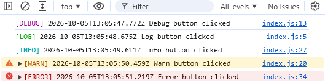
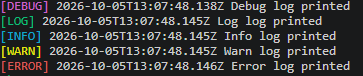

# Simple and Colorful Logger Library

Logger library for colorful and simple logging in JavaScript applications.
It also adds timestamps to each log message.

## Installation

You can install the logger library using npm:

```bash
npm install @yigithsyn/logger
```

## Usage

### Vanilla JavaScript

```html
<script src="https://unpkg.com/@yigithsyn/logger"></script>

<script>
    console.debug('This is a debug message');
    console.log('This is a log message');
    console.info('This is an info message');
    console.warn('This is a warning message');
    console.error('This is an error message');
</script>
```

### CommonJS

```javascript
require('@yigithsyn/logger');

console.debug('This is a debug message');
console.log('This is a log message');
console.info('This is an info message');
console.warn('This is a warning message');
console.error('This is an error message');
```

### ES Modules

```javascript
import '@yigithsyn/logger';

console.debug('This is a debug message');
console.log('This is a log message');
console.info('This is an info message');
console.warn('This is a warning message');
console.error('This is an error message');
```

## Output Format

### HTML Console:



### Terminal Console:



## Command Line Interface (CLI)

You can use the logger library from the command line to log messages with different log levels.

### Usage

```bash
logger <logLevel> <logMessage> [-h, --help]
```

### Options

- `logLevel`    The log level to use (e.g., "debug", "log", "info", "warn", "error"). Defaults to "info".
- `logMessage`  The log message to output.
- `-h, --help`  Show this help message.

### Examples

```bash
logger info "This is an info message"
logger warn "This is a warning message"
logger error "This is an error message"
```


## License

This project is licensed under the BSD License.